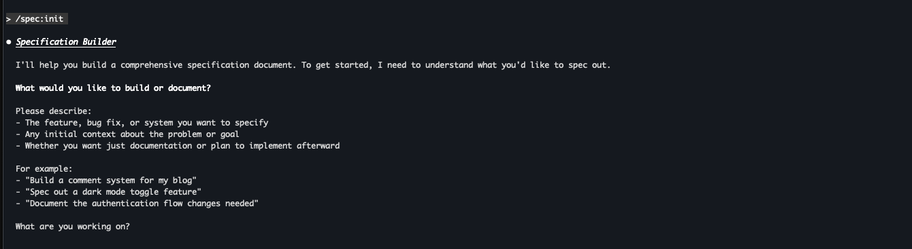

# /spec:init

Interview-driven specification builder for Claude Code.



> *"For big features Claude might ask me 40+ questions and I end up with a much more detailed spec that I feel I had a lot of control over."* — [@trq212](https://x.com/trq212)

## Install

```bash
/plugin marketplace add ashikshafi08/claude-spec-plugin
/plugin install spec@spec-tools
```

## Usage

```bash
/spec:init <what you want to build>
```

**Examples:**
```bash
/spec:init build a notification service
/spec:init document the auth flow
/spec:init caching layer
```

## How It Works

1. **Interview** — Claude asks deep questions about your feature
2. **Generate** — Creates comprehensive `SPEC.md` with diagrams, file paths, test commands
3. **Execute** — Optionally continues to implementation

See [DOCS.md](DOCS.md) for full usage guide and screenshots.

## License

MIT
