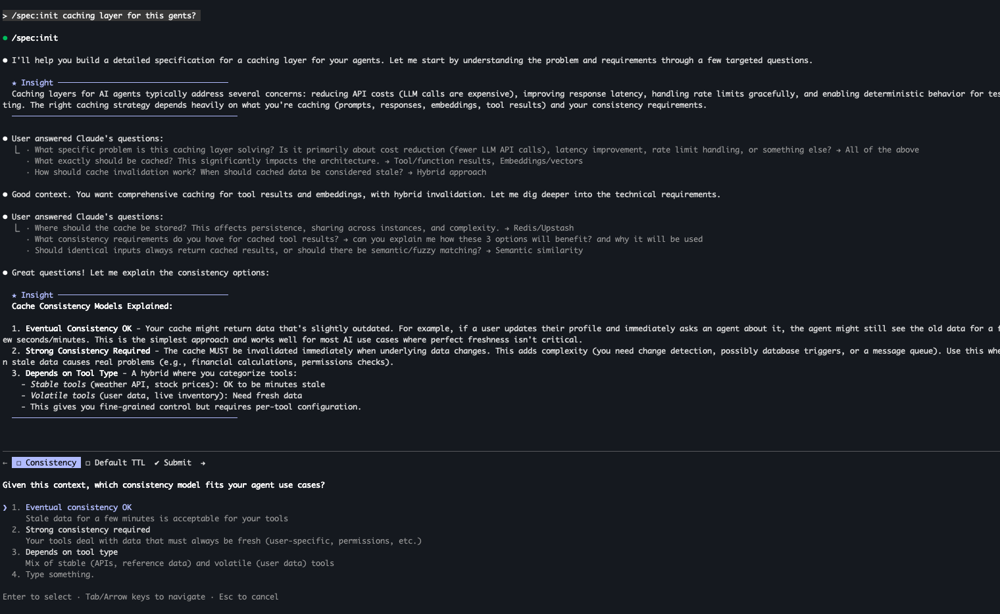
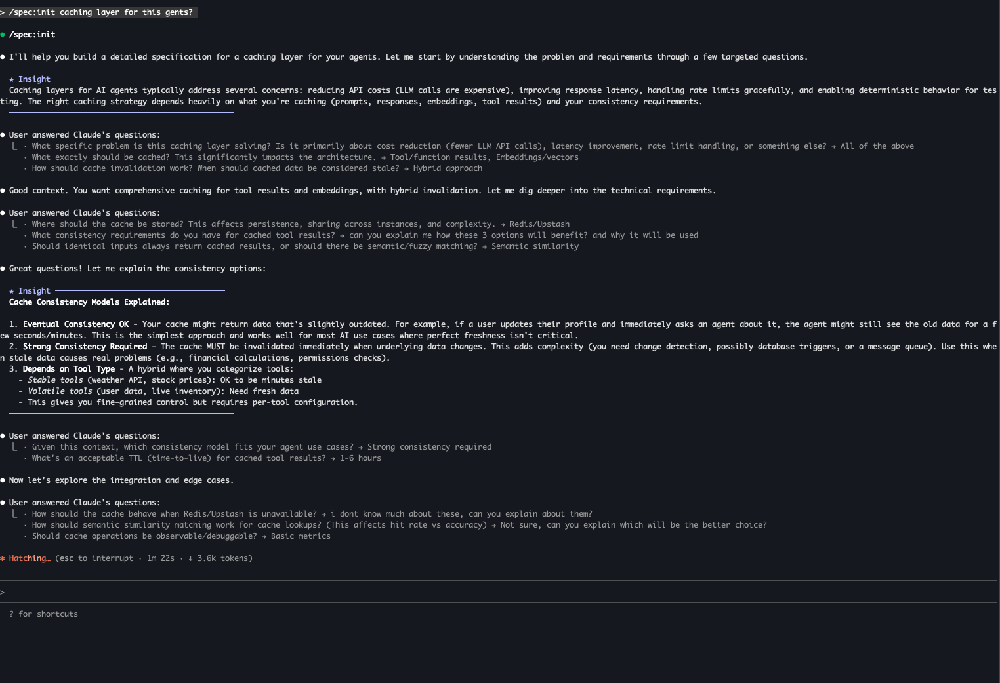
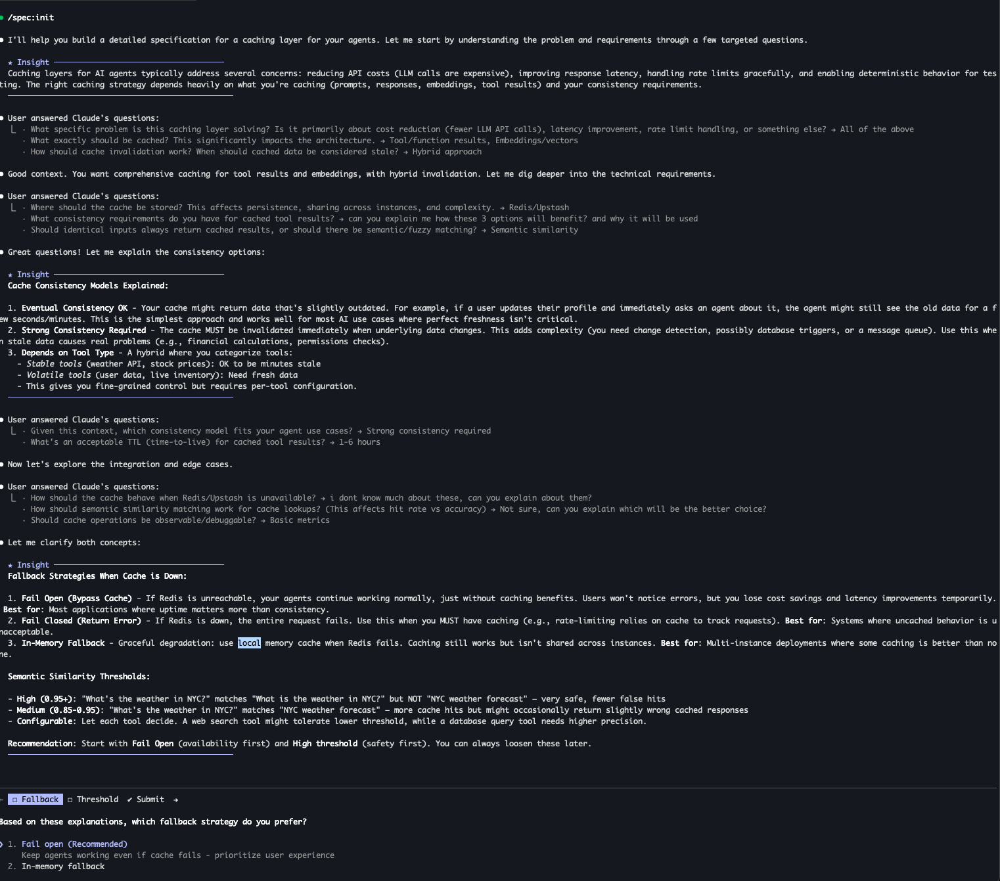

# /spec:init - Interview-Driven Specification Builder

Build comprehensive specifications through deep-dive interviewing, with adaptive execution based on your intent.

## Demo








## Installation

### From Marketplace (Recommended)

```bash
# Add the marketplace
/plugin marketplace add ashikshafi08/claude-spec-plugin

# Install the plugin
/plugin install spec@spec-tools
```

### Direct Installation

```bash
/plugin install github:ashikshafi08/claude-spec-plugin
```

### Manual Installation

Clone to your global plugins directory:
```bash
git clone https://github.com/ashikshafi08/claude-spec-plugin.git ~/.claude/plugins/spec
```

## Usage

### Basic Usage
```bash
/spec:init <description of what you want to build>
```

### Examples

**Documentation only** (creates SPEC.md, then stops):
```bash
/spec:init document the authentication system requirements
/spec:init spec out a caching layer
/spec:init write spec for user onboarding
```

**Implementation** (creates SPEC.md, then builds):
```bash
/spec:init build a notification service
/spec:init implement user authentication with OAuth
/spec:init add dark mode to settings page
```

**Exploratory** (creates SPEC.md, then asks what to do):
```bash
/spec:init caching
/spec:init think through the migration approach
/spec:init user dashboard
```

### Resume Mode

Implement an existing spec:
```bash
/spec:init implement ./SPEC.md
```

## How It Works

### Phase 0: Intent Detection
Analyzes your prompt to determine behavior:
- **"document", "spec out", "PRD"** → End after SPEC.md
- **"build", "implement", "create"** → Auto-continue to implementation
- **Unclear** → Ask you what to do next

### Phase 1: Interview
Claude conducts a deep interview covering:
- Problem & success criteria
- Technical architecture (for Mermaid diagrams)
- Codebase context (existing patterns, file locations)
- UI/UX (if applicable)
- Edge cases & error handling
- Performance & security
- Testing & verification commands
- Debugging & observability

Questions are:
- Non-obvious (probes deeper than surface level)
- Adaptive (based on what you're building)
- Context-aware (builds on previous answers)

### Phase 2: Generate SPEC.md
Creates a comprehensive specification optimized for Claude Code agents:
- **Quick Reference** - Complexity, file counts, verification command at a glance
- **Problem Statement** - What we're solving and why
- **Goals & Non-goals** - Clear scope boundaries
- **System Architecture** - Mermaid diagrams for visualization
- **File Structure** - Exact paths for files to create/modify
- **Codebase Patterns** - `file:line` references to follow
- **Implementation Plan** - Phase dependencies with blocking info
- **Verification Commands** - Test commands with expected output
- **Debugging Guide** - Logging points, metrics, common issues

### Phase 3: Adaptive Execution
Based on detected intent:
1. **End** - SPEC.md saved, you decide when to implement
2. **Ask** - You choose: execute now, later, or review first
3. **Continue** - Enters plan mode, designs implementation, executes

## Output

Specifications are saved to `./SPEC.md` in your project root.

## Why This Approach?

From [@trq212](https://x.com/trq212):
> "My favorite way to use Claude Code to build large features is spec based. Start with a minimal spec or prompt and ask Claude to interview you using the AskUserQuestionTool... for big features Claude might ask me 40+ questions and I end up with a much more detailed spec that I feel I had a lot of control over."

Benefits:
- **Thorough requirements** - Interview uncovers edge cases you'd miss
- **Clear scope** - Explicit non-goals prevent scope creep
- **Better implementation** - Spec guides execution with clear success criteria
- **User control** - You validate requirements before any code is written
- **Agent-optimized** - File paths, patterns, and commands help Claude Code work effectively

## Contributing

Contributions welcome! Please open an issue or PR on [GitHub](https://github.com/ashikshafi08/claude-spec-plugin).

## License

MIT
