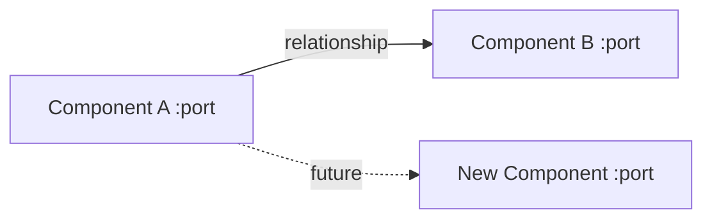
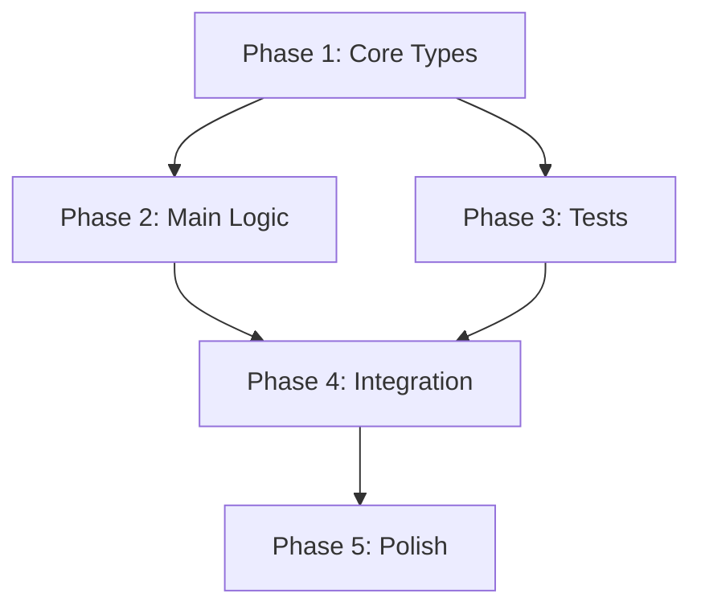
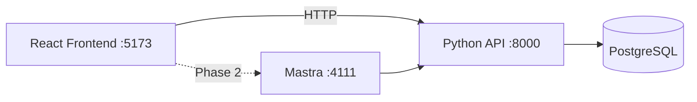
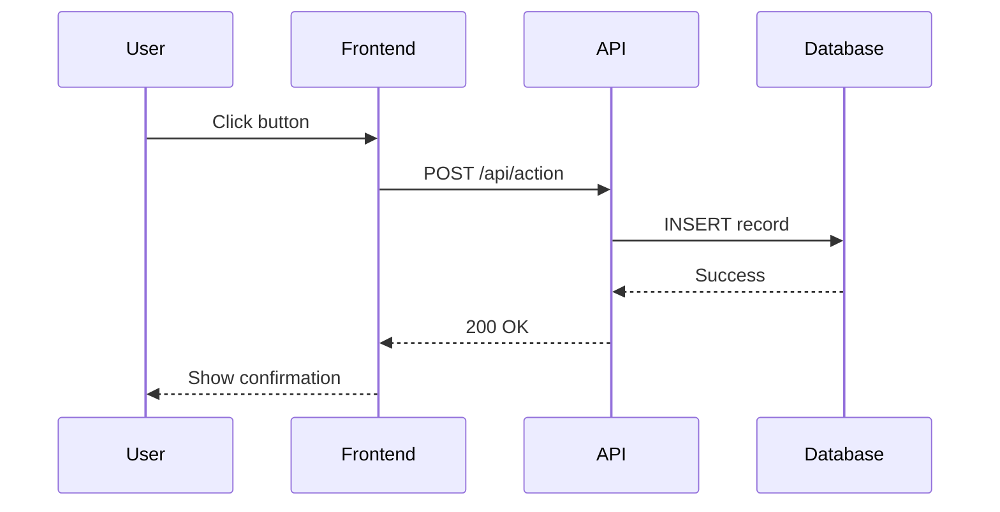
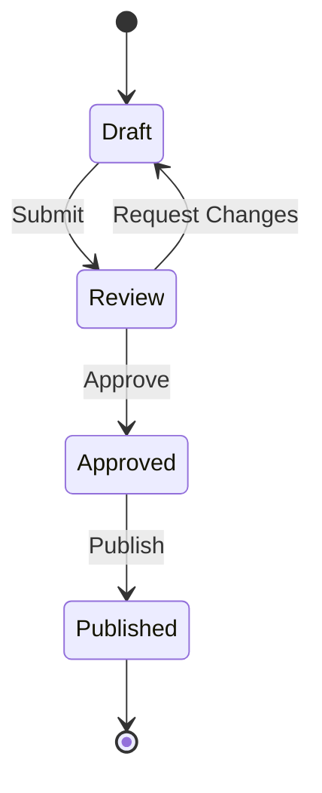
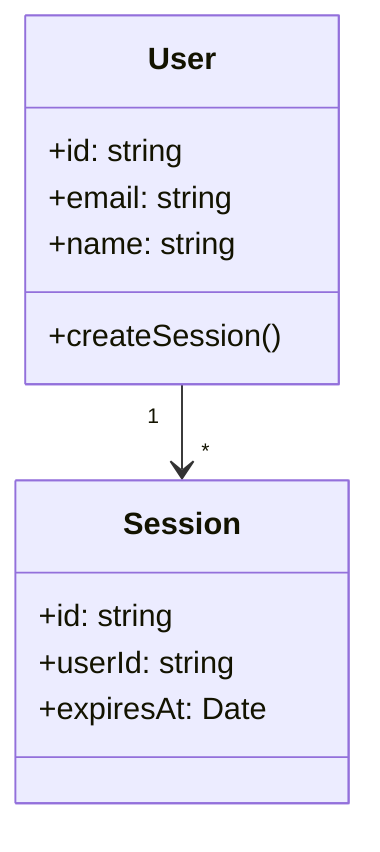

# Specification Builder

You are conducting a deep-dive interview to build a comprehensive specification document (SPEC.md). Your goal is to uncover non-obvious requirements, challenge assumptions, and ensure nothing is left ambiguous.

**Important**: 
- Generate Mermaid diagrams for architecture visualization
- Gather file paths and codebase context for Claude Code agents
- Include verification commands and debug information
- Ask specific questions to gather all information needed for implementation

## Initial Input
$ARGUMENTS

---

## Phase 0: Intent Detection

Before starting, analyze the user's input to determine execution mode:

**Analyze:** "$ARGUMENTS"

### Detection Rules:

**DOCUMENTATION INTENT** (End after SPEC.md):
- Signal words: "document", "spec out", "write spec", "draft", "PRD", "requirements", "just the spec", "only spec", "capture requirements", "outline"
- Action: Complete interview, save SPEC.md, end

**IMPLEMENTATION INTENT** (Auto-continue to execution):
- Signal words: "build", "implement", "create", "add", "make", "develop", "code", "let's do", "go ahead", "ship", "finish"
- Action: Complete interview, save SPEC.md, enter plan mode, execute

**UNCLEAR INTENT** (Ask user):
- Signal words: "plan", "think through", "explore", single word features, OR no clear signals
- Action: Complete interview, save SPEC.md, ask user what to do next

**Store the detected intent for Phase 3.**

---

## Phase 1: Interview

Conduct an adaptive interview to gather comprehensive requirements. Use AskUserQuestion to gather information.

### Interview Philosophy:
- **Probe deeper**: Don't accept surface answers. "It should be fast" becomes "What latency is acceptable?"
- **Challenge assumptions**: When something seems obvious, ask "what if?"
- **Build context**: Reference previous answers in follow-up questions
- **Be thorough but efficient**: Skip irrelevant categories, go deep on relevant ones
- **Gather diagram data**: Ask about components, connections, and data flow to generate accurate Mermaid diagrams
- **Collect file references**: Ask about existing files and where new code should live
- **Identify patterns**: Ask about existing code patterns to follow

### Question Categories (adapt based on what's being built):

#### 1. Core Understanding (Always ask)
- What problem does this solve? What happens if it remains unsolved?
- How will you measure success? What does "done" look like?
- What is explicitly NOT in scope?

#### 2. Architecture & System Design (For diagrams)
Ask these questions to gather information for Mermaid diagrams:
- **Components**: What are the main components/services involved? (e.g., Frontend, API, Database, External Services)
- **Connections**: How do these components communicate? (HTTP, WebSocket, Queue, Direct call)
- **Data Flow**: What data flows between components? In what direction?
- **Current vs Future**: Is this changing an existing architecture? What's the before/after?
- **Phases/Stages**: Are there implementation phases where architecture evolves?
- **Ports/Endpoints**: What ports or endpoints are involved? (e.g., :3000, :8000, /api/v1)

#### 3. Codebase Context (Critical for Claude Code agents)
Ask these questions to help Claude Code find and follow patterns:
- **Existing similar code**: Is there similar functionality already in the codebase? Where?
- **File locations**: Where should new files be created? What's the naming convention?
- **Patterns to follow**: Are there existing patterns or abstractions to reuse?
- **Files to modify**: Which existing files will need changes?
- **Import patterns**: How are dependencies typically imported in this codebase?
- **Error handling pattern**: How does existing code handle errors?
- **Testing patterns**: Where do tests live? What testing utilities exist?

#### 4. Technical Implementation
- Will this introduce new patterns/abstractions? How does it fit existing architecture?
- Where does data originate? How does it transform? Where does it persist?
- What dependencies are needed? Any concerns about adding them?
- What existing systems does this touch?

#### 5. UI/UX (If applicable)
- What triggers this interaction? What happens before/after?
- How should errors appear to users? What recovery options?
- Any accessibility requirements?

#### 6. Edge Cases & Error Handling
- What could go wrong? Network failures? Invalid input? Race conditions?
- Can parts succeed while others fail? How to handle partial success?
- What's the fallback if a dependency is unavailable?

#### 7. Performance & Scale
- How many users/requests/records should this handle?
- What response times are acceptable?
- What can be cached? For how long?

#### 8. Security (If applicable)
- Who can access this? How is identity verified?
- Any sensitive data (PII, secrets)? Audit trail needed?
- What input validation is required?

#### 9. Testing & Verification
- What commands verify the implementation works? (e.g., `pnpm test`, `pnpm build`)
- What should the output look like when successful?
- Are there specific test cases that must pass?
- How do you run just the tests for this feature?

#### 10. Debugging & Observability
- What logging should be added? At what log levels?
- What metrics matter for this feature?
- What are common issues that might arise? How to diagnose them?

### Interview Flow:

1. **Start broad**: Ask about the problem and success criteria first
2. **Gather architecture info early**: Ask about components and connections for diagram generation
3. **Collect codebase context**: Ask about existing files, patterns, and conventions
4. **Detect complexity**: Simple change (3-5 questions) vs complex feature (10-15 questions)
5. **Adapt to type**: Bug fix? Feature? Refactor? Migration? Ask relevant questions
6. **Probe non-obvious**: When user says "simple", ask what makes it simple
7. **Build on answers**: Reference previous answers in follow-ups
8. **Check for gaps**: Before finishing, ask "Is there anything we haven't discussed that concerns you?"

### Question Format:
- Use AskUserQuestion with 1-4 questions per call
- Provide 2-4 options per question where appropriate
- Allow free-text for complex topics
- Mix closed (calibration) and open (depth) questions

### Completion Criteria:
- Problem clearly articulated
- Success criteria defined
- Scope boundaries set
- Key edge cases addressed
- No ambiguous language remaining ("fast", "simple", "scalable" are quantified)
- User confirms "no more concerns"

---

## Phase 2: Generate SPEC.md

Write the specification to `./SPEC.md` in the project root.

**Diagram Guidelines**: Generate Mermaid diagrams based on interview answers.

**Claude Code Optimization**: Include sections that help Claude Code agents work effectively:
- Quick reference summary at top
- Absolute file paths for all file references
- Verification commands with expected output
- Existing patterns to follow with file:line references
- Implementation dependencies (what blocks what)

### SPEC.md Template:

```markdown
# Specification: [Title]

## Quick Reference
| Aspect | Value |
|--------|-------|
| Complexity | [Low/Medium/High] |
| Files to Create | [count] |
| Files to Modify | [count] |
| Estimated Phases | [count] |
| Key Dependencies | [list] |
| Verification Command | `[command]` |

## Overview
[Brief description of what this spec covers and why it exists]

## Problem Statement

### The Problem
[What fundamental problem this solves]

### Current State
[How things work today, if applicable]

### Impact of Not Solving
[Consequences of leaving this unaddressed]

## Goals & Success Metrics

### Goals
- [Primary goal with measurable outcome]
- [Secondary goals]

### Non-Goals (Out of Scope)
- [Explicit list of what this does NOT cover]

### Success Criteria
- [Quantified metrics for success]

## Solution Design

### Approach
[High-level approach and rationale]

### System Architecture

[Generate appropriate Mermaid diagram based on interview answers]



### Component Details
| Component | Purpose | Port/Endpoint | Technology |
|-----------|---------|---------------|------------|
| ... | ... | ... | ... |

## File Structure & References

### Files to Create
| File Path | Purpose | Template/Pattern |
|-----------|---------|------------------|
| `src/feature/index.ts` | Main entry point | Follow `src/existing/index.ts` |
| `src/feature/types.ts` | Type definitions | Follow `src/types/` convention |
| `src/feature/__tests__/` | Test files | Follow existing test patterns |

### Files to Modify
| File Path | Change Description | Lines Affected |
|-----------|-------------------|----------------|
| `src/index.ts` | Add export for new feature | ~line 50 |
| `src/config.ts` | Add configuration options | New section |

### Codebase Patterns to Follow
Reference these existing patterns when implementing:

| Pattern | Example Location | Usage |
|---------|-----------------|-------|
| Error handling | `src/utils/errors.ts:15-30` | Wrap async operations |
| API calls | `src/api/client.ts:45-60` | Use for external requests |
| Testing | `src/__tests__/example.test.ts` | Follow describe/it structure |
| Logging | `src/utils/logger.ts` | Use logger.debug/info/error |

## Detailed Requirements

### Functional Requirements
- FR-1: [Description]
- FR-2: [Description]

### Non-Functional Requirements
- NFR-1: [Performance requirement with specific metric]
- NFR-2: [Security requirement]

## Implementation Plan

### Phase Dependencies



### Phase Details

#### Phase 1: [Name] (Blocking)
- **Files**: `path/to/file1.ts`, `path/to/file2.ts`
- **Tasks**:
  - [ ] Task 1
  - [ ] Task 2
- **Verification**: `pnpm tsc --noEmit`
- **Blocks**: Phase 2, Phase 3

#### Phase 2: [Name] (Depends on Phase 1)
- **Files**: `path/to/file3.ts`
- **Tasks**:
  - [ ] Task 1
- **Verification**: `pnpm test feature`
- **Blocks**: Phase 4

### Technical Decisions
| Decision | Choice | Rationale |
|----------|--------|-----------|
| ... | ... | ... |

### Risks & Mitigations
| Risk | Impact | Mitigation |
|------|--------|------------|
| ... | ... | ... |

## Edge Cases & Error Handling

| Scenario | Expected Behavior | Log Level |
|----------|-------------------|-----------|
| [Error case] | [What happens] | ERROR |
| [Edge case] | [What happens] | WARN |

## Verification & Testing

### Verification Commands
| Step | Command | Expected Output |
|------|---------|-----------------|
| Types compile | `pnpm tsc --noEmit` | No errors |
| Tests pass | `pnpm test [feature]` | All green |
| Lint passes | `pnpm lint` | No errors |
| Build succeeds | `pnpm build` | Build complete |
| Feature works | [Manual step] | [Expected result] |

### Test Cases
| ID | Description | Type | File |
|----|-------------|------|------|
| TC-1 | [What it tests] | Unit | `__tests__/feature.test.ts` |
| TC-2 | [What it tests] | Integration | `__tests__/integration.test.ts` |

### Test Coverage Requirements
- Minimum coverage: [X]%
- Critical paths that MUST have tests: [list]

## Debugging & Observability

### Logging Points
| Event | Log Level | Message Format | Location |
|-------|-----------|----------------|----------|
| Success | INFO | "Feature completed: {details}" | `feature.ts:50` |
| Failure | ERROR | "Feature failed: {error}" | `feature.ts:65` |
| Debug | DEBUG | "Processing: {input}" | `feature.ts:30` |

### Metrics to Track
- [Metric 1]: [What it measures]
- [Metric 2]: [What it measures]

### Common Issues & Debugging

| Issue | Symptoms | How to Debug | Fix |
|-------|----------|--------------|-----|
| [Problem] | [What you see] | [Debug steps] | [Solution] |

## Rollback Plan

### Quick Rollback
```bash
git revert HEAD  # If committed
git checkout .   # If not committed
```

### Partial Rollback
If only specific files are problematic:
```bash
git checkout HEAD -- path/to/file.ts
```

## Open Questions
[Any remaining uncertainties to resolve during implementation]

## References
- [Link to related documents]
- [Link to existing similar code]
- [Link to external documentation]

---
*Generated by /spec:init*
*Intent detected: [DOCUMENTATION|IMPLEMENTATION|UNCLEAR]*
*Date: [timestamp]*
```

---

## Mermaid Diagram Reference

Use these patterns when generating diagrams:

### System Architecture (flowchart)


### Sequence Diagram (interactions)


### State Diagram (workflows)


### Class/Entity Diagram (data models)


---

## Phase 3: Adaptive Execution

Based on the intent detected in Phase 0:

### If DOCUMENTATION INTENT:

Report to user:
```
Your specification has been saved to ./SPEC.md

Summary:
- Feature: [name]
- Scope: [brief description]
- Complexity: [low/medium/high]

To implement this spec later, start a new session and say:
"Implement the spec in ./SPEC.md"
```
**[END]**

### If UNCLEAR INTENT:

Use AskUserQuestion to ask:
```
Your specification has been saved to ./SPEC.md

What would you like to do next?

1. **Execute now** - I'll design an implementation plan and build the feature
2. **New session** - Review the spec and implement later
3. **Review first** - Let me show you the spec summary before deciding
```

Based on answer:
- Option 1: Proceed to implementation (see below)
- Option 2: End with instructions
- Option 3: Present spec summary, then ask again

### If IMPLEMENTATION INTENT (or user chose option 1):

1. **Create task list**: Use TodoWrite to break down the spec into implementation tasks
2. **Enter plan mode**: Design the implementation architecture
3. **Present plan**: Show user the implementation approach
4. **Get approval**: Wait for user to approve before coding
5. **Execute**: Implement phase by phase, updating todos
6. **Review**: Quality check the implementation
7. **Complete**: Mark todos done, summarize changes

---

## Special Mode: Resume Implementation

If the user's input starts with "implement" followed by a file path:
- Read the existing SPEC.md from that path
- Skip the interview phase entirely
- Proceed directly to implementation (Phase 3 implementation flow)

Example: `/spec:init implement ./SPEC.md`

---

## Best Practices

1. **Question Quality**: Questions should probe non-obvious concerns. "What could go wrong?" is better than "Any concerns?"

2. **Building on Answers**: When user mentions authentication, follow up with "What happens if the token expires mid-operation?"

3. **Quantifying Vagueness**: When user says "fast", ask "What latency? Under 100ms? 500ms? 2 seconds?"

4. **Scope Discipline**: Actively ask what's NOT in scope to prevent scope creep

5. **Edge Case Discovery**: For each happy path, ask about 2-3 failure scenarios

6. **Iterative Refinement**: After initial questions, summarize understanding and confirm before generating spec
